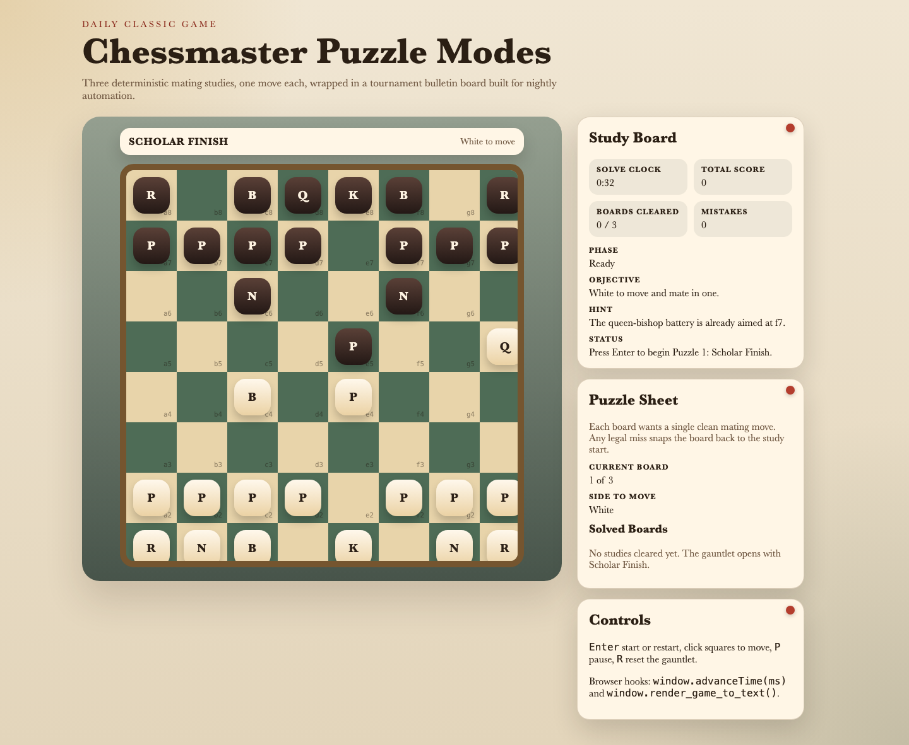
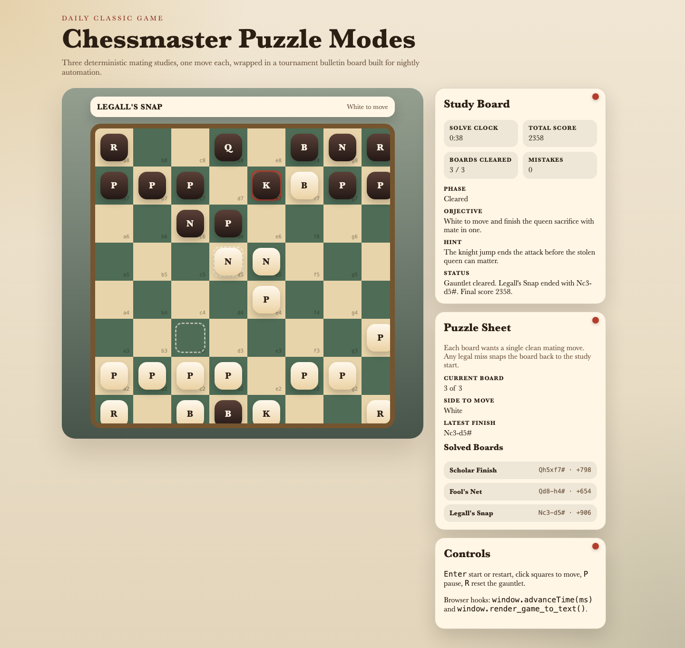

# daily-classic-game-2026-05-04-chessmaster-puzzle-modes

  <h3>Deterministic chess tactics as a three-board mate gauntlet with solve clocks, exact legal move validation, and automation-ready browser hooks.</h3>
  
Clear Scholar Finish, punish Fool's Net from the black side, and close with Legall's Mate before the study timer burns away your bonus.

  
  

## Quick Start
- `pnpm install`
- `pnpm dev`
- Open `http://127.0.0.1:4173`

## How To Play
- Press `Enter` to activate the current puzzle board.
- Click the side-to-move piece, then click one of its highlighted legal target squares.
- Each board asks for mate in one. A correct mating move advances to the next study automatically.
- Press `P` to pause the solve clock and `R` to reset the full three-board gauntlet.

## Rules
- The gauntlet contains three deterministic chess studies in a fixed order: Scholar Finish, Fool's Net, and Legall's Snap.
- Every board uses full chess legality, including check resolution, so illegal moves are rejected before they can land.
- Any legal move that does not end the current board in checkmate resets that board to its study setup.
- Letting the solve clock expire also resets the current board and applies the same score penalty.

## Scoring
- Clearing a board awards `240` base points plus `18` points for each whole second still on the solve clock.
- A missed mating move or a clock expiry costs `90` points, but the total score never drops below zero.
- The reference scripted clear captured in `pnpm capture` finishes with `2358` points and zero mistakes.

## Twist
- **Puzzle Modes** turns Chessmaster into a rapid tactics board instead of a full match.
- The gauntlet alternates who moves next when useful, so one study asks White to finish while another lets Black deliver the punishment.
- Famous mating patterns are reduced to one decisive move each, making the run deterministic and easy to verify end to end.

## Verification
- `pnpm test`
- `pnpm build`
- `pnpm capture`
- Browser hooks:
  - `window.advanceTime(ms)`
  - `window.render_game_to_text()`
- Scripted route:
  - `Qh5xf7#`
  - `Qd8-h4#`
  - `Nc3-d5#`

## Project Layout
- `src/` puzzle session engine, board UI, and study-board presentation
- `tests/` deterministic puzzle-flow coverage
- `scripts/` static build, self-check, and Playwright capture pipeline
- `docs/plans/` implementation notes and mouse-action payload
- `artifacts/playwright/` screenshots, GIF clips, copied action payload, and final render dump

## GIF Captures
- `clip-01-scholar-finish.gif` - queen-bishop battery closes the first board on f7
- `clip-02-fools-net.gif` - Black punishes the weakened diagonal with `Qd8-h4#`
- `clip-03-legalls-snap.gif` - the final knight jump lands Legall's Mate and clears the run
